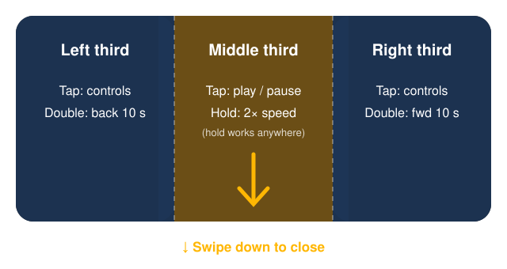

# Help — Sparklux Go (iPhone / iPad)

**SDR video, at HDR brightness.** Browse the folders on your Mac or NAS and play videos directly.

## Requirements

- iOS / iPadOS 26 or later
- **An HDR-capable screen** (iPhone 12 or later, iPad Pro, etc.). Videos still play on other screens, but SDR-to-HDR conversion does not run (the app tells you so)

## Open a shared folder on your Mac

1. **On the Mac**: System Settings › General › Sharing › turn on **File Sharing** and add the folders you want to share
2. **In the app**: tap your Mac under **Network** (if it does not appear, use **Add Server** and type its host name or IP address)
3. Enter your Mac user name and password, then **Connect**

!!! note "If you are asked about Local Network the first time"
    Tap **Allow**. The first attempt right after allowing may fail once — just tap **Connect** again.
    If you declined, turn on Sparklux Go in Settings › Privacy & Security › Local Network.

NAS devices (Synology, QNAP, etc.) work over SMB too. **Shares that require SMB3 encryption are not supported yet.**

## Other ways to open videos

| Source | How |
|---|---|
| A folder in the Files app | **Add Folder** — browse it again next time |
| A single file | **Open File** |
| Photos | **Choose from Photos** (HDR recordings stay as they are) |
| URL | **Open URL** — direct links to video files (.mp4 / .mov / .m3u8) |

!!! warning "Streaming services such as YouTube cannot be opened"
    Their video pages are not video files, so they cannot be played.

## Supported formats

MP4 / MOV / M4V / HLS (.m3u8) / **MKV**. H.264 and HEVC video (including 10-bit, HDR10, HLG and Dolby Vision 8.1).

- For MKV, only the default audio track plays. MKV embedded subtitles are planned for a future update
- Dolby Vision Profile 5 cannot be shown in correct colours (the app tells you so)

## Controls while playing

The screen is split into left, middle and right thirds. What happens depends on where you tap.

| Gesture | Action |
|---|---|
| Tap the middle | When the controls are hidden: play / pause (while paused, the controls stay on screen). When the controls are shown: hides the controls only (no play / pause) |
| Tap the left or right | Show / hide the controls |
| Double-tap the left | Back 10 seconds (keep tapping for 20, 30…) |
| Double-tap the right | Forward 10 seconds (keep tapping for 20, 30…) |
| Touch and hold (anywhere) | 2× speed while you hold. Back to normal when you let go (while playing) |
| Pinch with two fingers | Zoom in / out (1× to 4×), centered between your fingers. Let go near 1× or near "fill the screen" (no black bars) and it snaps to that size |
| Drag while zoomed | Moves the zoomed picture (it stops at the edges). While zoomed, swiping down does not close the player |
| Double-tap with two fingers | Back to 1×. The zoom button in the controls (for example "2.3×") does the same |
| Swipe down (at 1×) | Closes the player. Pull about a fifth of the screen, or flick quickly. If not far enough, it springs back (does not start on the controls or near the A/B divider) |

The **controls** have a seek bar, back / forward 10 seconds, play / pause, ✨ (Picture) and × (close). While zoomed, a zoom button (tap for 1×) also appears. Upscaling and super resolution work on the part of the picture you see while zoomed.

## Picture settings

Tap ✨ to open the picture settings.

| Setting | What it does |
|---|---|
| **Natural** (default) | Natural brightness. Hard to break |
| Vivid | Keeps colour strong in bright areas |
| Brighter, as is | Same contrast, lifted to the screen's full brightness |
| No conversion | Shows the source as it is |
| A/B compare | Left: current preset, right: no conversion. Drag the divider |
| Upscale to screen resolution | When the video is smaller than the screen, scales it to the screen's native resolution |
| Frame interpolation | Smooths motion. On by default (you can turn it off in the quality settings). When active, the output frame rate appears on screen, e.g. "Smooth 120fps". If unavailable, the reason is shown |
| Interpolation priority | Choose Resolution priority (default), Smooth priority or Ultra smooth priority (see below) |
| Audio & subtitles | Choose the audio track and subtitles |
| Now | Headroom (how many times brighter than normal white, e.g. ×8.0), source resolution, output resolution and screen refresh (Hz) |

**Interpolation priority**

The app always outputs the highest frame rate it can keep up with for that video and mode. The output is 120, 60, 40, 30 or 24 fps (values that stay evenly spaced on a 120 Hz screen), and never lower than the video's own frame rate.

| Mode | Interpolation resolution | Typical on iPhone 17 Pro Max |
|---|---|---|
| Resolution priority (default) | The video's own resolution (never scaled down) | 120 fps up to 720p, 60 fps at 1080p. 1440p and 4K are not interpolated |
| Smooth priority | Up to 1080p (larger videos are scaled down) | 4K and 1440p at 60 fps |
| Ultra smooth priority | 720p | 120 fps. 10-bit HDR videos are interpolated in 8-bit (gradients may band slightly) |

When the device gets hot or can't keep up, the app first lowers the frame rate one step (120→60→40), then (in Smooth and Ultra smooth priority) the interpolation resolution, and finally turns interpolation off. In Low Power Mode, interpolation and super resolution pause (the app tells you so). Colour conversion never pauses.

## Free trial and purchase

- On first launch you will see the **3-day** free trial. Tap **Start Free Trial** to begin
- When the trial ends, **playback stops** (you can still browse folders)
- To keep using the app, make a one-time purchase. **You are never charged automatically**
- After changing devices or reinstalling, tap **Restore Purchase**

## Troubleshooting

| Symptom | What to check |
|---|---|
| The server does not appear | Mac and iPhone on the same Wi-Fi? File Sharing on? Use **Add Server** with the host name (e.g. `name.local`) or IP address |
| "Loading… the disk may be spinning up" | An external HDD can take a few seconds to spin up |
| Playback stopped and **Try Again** appeared | The connection dropped. **Try Again** reopens from the same position |
| "This video needs more than the network provides…" | The video's data rate exceeds your Wi-Fi speed. Move closer to the router, or serve from a wired Mac |
| The picture does not get brighter | At maximum brightness some devices leave no HDR headroom. Lower it slightly |

## Contact

<hello@monneural.dev>
