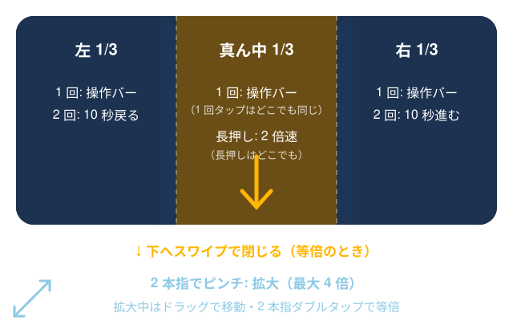

# ヘルプ — Sparklux Go（iPhone / iPad）

**SDR の動画を、HDR の明るさで。** 家の Mac や NAS にある動画を、フォルダをたどって開けます。

## 必要なもの

- iOS / iPadOS 26 以降
- **HDR 表示ができる画面**（iPhone 12 以降・iPad Pro など）。HDR 表示ができない画面でも再生はできますが、SDR→HDR 変換は働きません（画面にその旨が出ます）

## Mac の共有フォルダを開く

1. **Mac 側**: システム設定 → 一般 → 共有 → 「ファイル共有」をオンにし、共有したいフォルダを追加します
2. **本アプリ**: 「ネットワーク」に Mac の名前が出たらタップします（出ないときは「サーバを追加」でホスト名か IP アドレスを入力）
3. Mac のユーザー名とパスワードを入れて「接続」

!!! note "1 回目に「ローカルネットワーク」の確認が出たら"
    「許可」を押してください。許可の直後は 1 回失敗することがあるので、そのときはもう一度「接続」を押してください。
    許可しなかった場合は、iPhone の 設定 → プライバシーとセキュリティ → ローカルネットワーク で Sparklux Go をオンにします。

NAS（Synology・QNAP など）も SMB でつながります。**「SMB3 の暗号化が必須」に設定した共有には、現在つながりません。**

## ほかの開き方

| 開き方 | 操作 |
|---|---|
| 「ファイル」アプリのフォルダ | 「フォルダを追加」→ 次回からそのフォルダをたどれます |
| 1 本だけ開く | 「ファイルを開く」 |
| 写真ライブラリ | 「写真から選ぶ」（HDR で撮った動画もそのまま） |
| URL | 「URL を開く」→ 動画ファイルの直リンク（.mp4 / .mov / .m3u8） |

!!! warning "YouTube などの配信サービスは開けません"
    配信サービスの動画ページは、動画ファイルではないため再生できません。

## 対応している形式

MP4 / MOV / M4V / HLS（.m3u8）/ **MKV**。映像は H.264 と HEVC（10bit・HDR10・HLG・Dolby Vision 8.1 を含む）。

- MKV は、既定の音声トラックだけを再生します。MKV の内蔵字幕は、今後の更新で対応予定です
- Dolby Vision Profile 5 は、正しい色で表示できません（画面にその旨が出ます）

## 再生中の操作

画面を左・真ん中・右の 3 つに分けて、叩く場所で動きが変わります。

| 操作 | 動き |
|---|---|
| 真ん中を 1 回タップ | 再生 / 一時停止。止めている間は操作バーが出たままになります |
| 左右を 1 回タップ | 操作バーを出す / 消す |
| 左をダブルタップ | 10 秒戻る（続けて叩くと 20・30 秒と積み上がる） |
| 右をダブルタップ | 10 秒進む（続けて叩くと 20・30 秒と積み上がる） |
| 長押し（どこでも） | 押している間だけ 2 倍速。離すと元の速さに戻ります（再生中のみ） |
| 下へスワイプ | 再生画面を閉じる。画面の 2 割ほど引くか、素早く払うと閉じます。足りなければ元に戻ります（操作バーの上や A/B の境界の近くからは始まりません） |

**操作バー**には、シークバー・10 秒戻る / 進むボタン・再生 / 一時停止・✨（画質）・×（閉じる）があります。

## 画質の設定

✨ を押すと画質の画面が開きます。

| 設定 | 内容 |
|---|---|
| **ナチュラル**（既定） | 自然な明るさ。破綻しにくい |
| ビビッド | 明るい部分の色を強く残す |
| そのまま明るく | 明暗の差はそのまま、全体を画面いっぱいの明るさへ |
| 変換しない | 元のまま表示 |
| A/B 比較 | 左＝いまのプリセット、右＝変換しない。境界はドラッグで動かせます |
| 画面の解像度まで拡大 | 動画が画面より小さいとき、画面の実際の解像度まで拡大します |
| フレーム補間 | 動きを滑らかにします。最初からオンです（画質の設定で切れます）。効いているときは画面上に「滑らか 120fps」のように出す fps が出ます。効かないときは理由が出ます |
| 補間の優先 | 「解像度優先」（最初の設定）・「滑らか優先」・「超滑らか優先」から選びます（下の表） |
| 音声と字幕 | 音声トラック・字幕を選べます |
| いまの状態 | 明るさの余力（普通の白の何倍まで明るくできるか。例: ×8.0）・元の解像度・表示の解像度・画面の書き換え（Hz） |

**補間の優先**

いつも「その動画とモードで間に合ういちばん高い fps」で出します。出す fps は 120・60・40・30・24 のどれかで（120Hz の画面で間隔が揃う値）、元の動画の fps より下げることはありません。

| モード | 補間する解像度 | iPhone 17 Pro Max での目安 |
|---|---|---|
| 解像度優先（最初の設定） | 動画の解像度のまま（縮めません） | 720p 以下は 120fps、1080p は 60fps。1440p・4K は補間しません |
| 滑らか優先 | 1080p まで（大きい動画は 1080p に縮めます） | 4K・1440p も 60fps |
| 超滑らか優先 | 720p | 120fps。10bit の HDR 動画は 8bit に落として補間します（階調が少し粗くなることがあります） |

端末が熱くなったときや間に合わないときは、まず fps を一段下げ（120→60→40）、次に（滑らか優先・超滑らか優先なら）補間の解像度を下げ、最後に補間を止めます。低電力モードのときは補間と超解像を止めます（画面にその旨が出ます）。色の変換は止めません。

## 無料体験と購入

- 初めて起動したときに、無料体験（**3 日間**）の説明が出ます。「無料で始める」を押すと始まります
- 期間が終わると、**再生はできなくなります**（フォルダをたどることはできます）
- 続けて使うには、買い切りでご購入ください。**自動で課金されることはありません**
- 機種変更・再インストールのときは「購入を復元」を押してください

## うまくいかないとき

| 症状 | 確かめること |
|---|---|
| サーバーが一覧に出ない | Mac と iPhone が同じ Wi-Fi か。Mac の「ファイル共有」がオンか。「サーバを追加」でホスト名（例: `名前.local`）か IP アドレスを入れる |
| 「読み込み中… ディスクの起動を待っているかもしれません」 | 外付け HDD が回り始めるまで数秒かかることがあります |
| 途中で止まり「もう一度」が出た | 接続が切れました。「もう一度」で続きの位置から開き直します |
| 「この動画は、いまの回線より速く…」 | 動画のデータ量が Wi-Fi の速さを超えています。ルーターに近づくか、有線の Mac から配信してください |
| 画面が明るくならない | 画面の明るさを最大にすると、HDR の余地がなくなる端末があります。少し下げてください |

## お問い合わせ

<hello@monneural.dev>
